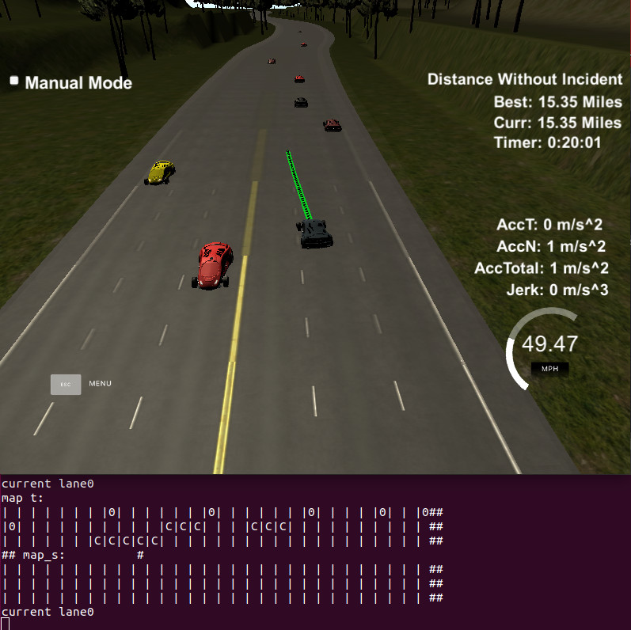

# CarND-Path-Planning-Project
Self-Driving Car Engineer Nanodegree Program
   


# path finding

There's many ways to find the path, in general going on highway is rather simple compared to find in for example a parkinglot (but more dangerous).
One easy approach is to just check all the other cars, and if there's a car x meter in front, but no car to one of the sides, go there. easily done with just some ifs.

However, I wanted to try to search the best path, for this I made some kind of A* but as we can't do quick turns, I instead use longer moves, I will come back to this later, as first we need to create a map.

### Map drawing

The type of map I decided to use have the lanes in one axis, and the other axis is using time.
the reason for this is that for example cars that are in front but driving the same speed or faster, will never really block us, so to turn for these would be stupid. Furthermore two other cars that for the moment is at the same position, but drive at different speed, will most likely not be next to each other when we catch up with them and as such we could sense early on that we can pass by there, or the opposite, to early see that we will be blocked at a later time, and as such already prepare to slow down.

I also included the acceleration, in the calculation, but as they can go up and down in acceleration quick, using only this can be a bit unsafe, so I decided to make an acceleration car to be longer, and take up the time-space between the time-position calculated with only speed to the position that included acceleration. 

A simple version of the algorithm is as follows:
```
for each car:
    if nearby
        calculate time until we're at the same position
        calculate time but also use acceleration
        on the map, draw a car between these points.
        extend car further for safety distance
        if car is about to change lane, draw in both lanes.
```
An example of this with 2 cars on the road.
```
| | | | | | | | | | | | | | | | | |C|C|C|C|C|C| | | | | | | 
| | | | | | | | | | | | | |C|C|C|C|C| | | | | | | | | | | | 
| | | | | | | | | | | | | | | | | | | | | | | | | | | | | | 
```
for more details, see [car_2_map() in helpers.h, line 452-527](https://github.com/henrisve/CarND-Path-Planning-Project/blob/ae72438caf1ec2964770e57c27056685727d5d23/src/helpers.h#L452-L527)
and in [main.cpp, line172-225](https://github.com/henrisve/CarND-Path-Planning-Project/blob/ae72438caf1ec2964770e57c27056685727d5d23/src/main.cpp#L172-L225)
### Search for path

An mentioned earlier, the path finder uses an A* with various step length, in my case I used a length between 3 and 7. (which should be around 1.5 second to 3.5 second). Besides from this it's pretty much a standard A* with the heuristic function :

```new_g + (max_y - landing_y) * 4 + abs(direction) * 50  * (max_len - len + 1);```

where:
* new_g : the distance traveled.
* max_y : the length to the goal.
* landing_y : the new position in y, here y is the time axis.
* direction : lane change, can be {-1,0,1}, where -1 is turn left, 0 go straight and 1 turn right.
* max_len : longest step, in this case 7
* len : step size used in this case.

So in other words:
* (max_y - landing_y) * 4 : This will give points towards goal lower value.
* abs(direction) * 50  : turning is bad, unless we have to do it.
* (max_len - len + 1) : prefer turns that are longer.

Furthermore, as there's multiple path to the same point, where the first may not be the best, we also keep track of the best path to each position, and if a new
path is better, we update to this.

To save computation and have less risk that the path jumps between paths, we only calculate a new path if the old path get blocked.

Here's an example using the map above.
```
| | | | | | | | | | | | | | | | | |C|C|C|C|C|C| | | | | | | 
|0| | | | |0| | | | | | | |C|C|C|C|C| | | | | | | | | | | | 
| | | | | | | | | | | | |0| | | | | | |0| | | | | | |0| | |0
```

For more details, see [function search_path() in helpers.h, line 321-450](https://github.com/henrisve/CarND-Path-Planning-Project/blob/ae72438caf1ec2964770e57c27056685727d5d23/src/helpers.h#L321-L450)

## Lane change

In my first version I used the output directly from the path finder, however, this turned out to not be as smooth as I hoped, so after lots of tries I decided to step back and simply use the second position in the path as decision for a lane change.
furthermore as the path finding can be a bit jumpy when lots of cars is around, there's a limit for how often lane changes is allowed.
this can be found in [main.cpp, line 324-344](https://github.com/henrisve/CarND-Path-Planning-Project/blob/ae72438caf1ec2964770e57c27056685727d5d23/src/main.cpp#L324-L344)
## Trajectory calrulation

The base of my code was based on the QA given by udacity, so I used a spline that was calculated by 3 points. 

For the calculation of speed I use as input a max acceleration and max jerk, and from these calculate the maximum speed for the next point. however, as this was only using the x values (forward direction), this will exceed these values while changing lanes, as such I went with pretty low values. An improved version could include the sideway acceleration and jerk and as such be able to use full acceleration when needed without exceeding it. 

## Path not found

so, what if we're blocked by the cars ahead? in this case the pathfinder will return the best path found along with a flag to tell us that it's blocked, we will then try to get behind the car that is currently the best choise, this may lead to going back and forth between the lanes as the other cars is pretty stupid and accelerate/deaccelerate rather unpredicted. But hopefully we will be in a spot that will soon open up and we can drive past the cars.

During the time being blocked, we will try to keep a fixed distance from the car ahead using a simple p-regulator, and as soon we have a possible path, we go for it. This can be found in [main.cpp, line 227-254](https://github.com/henrisve/CarND-Path-Planning-Project/blob/ae72438caf1ec2964770e57c27056685727d5d23/src/main.cpp#L227-L254)
## future improvements. 

* currently we might get hit by a car going very fast from behind, this should be improved in the calculation of the map..
* use both x and y when calculate the speed, so that we fully can use the allowed acceleration.
* To be on the safe side, we do slow down sometimes when passing by a car (as we get too close), I added this due to at some points colliding with the car in front after getting out from a blocked scenario.
* reduce the amount of bad lane change, as we sometimes change lane and then change back soon after. 
* use a smarter way to predict when other cars is changing lanes (perhaps as was done in the lectures)


# INSTRUCTIONS: (old readme)

# CarND-Path-Planning-Project
Self-Driving Car Engineer Nanodegree Program
   
### Simulator.
You can download the Term3 Simulator which contains the Path Planning Project from the [releases tab (https://github.com/udacity/self-driving-car-sim/releases/tag/T3_v1.2).  

To run the simulator on Mac/Linux, first make the binary file executable with the following command:
```shell
sudo chmod u+x {simulator_file_name}
```

### Goals
In this project your goal is to safely navigate around a virtual highway with other traffic that is driving +-10 MPH of the 50 MPH speed limit. You will be provided the car's localization and sensor fusion data, there is also a sparse map list of waypoints around the highway. The car should try to go as close as possible to the 50 MPH speed limit, which means passing slower traffic when possible, note that other cars will try to change lanes too. The car should avoid hitting other cars at all cost as well as driving inside of the marked road lanes at all times, unless going from one lane to another. The car should be able to make one complete loop around the 6946m highway. Since the car is trying to go 50 MPH, it should take a little over 5 minutes to complete 1 loop. Also the car should not experience total acceleration over 10 m/s^2 and jerk that is greater than 10 m/s^3.

#### The map of the highway is in data/highway_map.txt
Each waypoint in the list contains  [x,y,s,dx,dy] values. x and y are the waypoint's map coordinate position, the s value is the distance along the road to get to that waypoint in meters, the dx and dy values define the unit normal vector pointing outward of the highway loop.

The highway's waypoints loop around so the frenet s value, distance along the road, goes from 0 to 6945.554.

## Basic Build Instructions

1. Clone this repo.
2. Make a build directory: `mkdir build && cd build`
3. Compile: `cmake .. && make`
4. Run it: `./path_planning`.

Here is the data provided from the Simulator to the C++ Program

#### Main car's localization Data (No Noise)

["x"] The car's x position in map coordinates

["y"] The car's y position in map coordinates

["s"] The car's s position in frenet coordinates

["d"] The car's d position in frenet coordinates

["yaw"] The car's yaw angle in the map

["speed"] The car's speed in MPH

#### Previous path data given to the Planner

//Note: Return the previous list but with processed points removed, can be a nice tool to show how far along
the path has processed since last time. 

["previous_path_x"] The previous list of x points previously given to the simulator

["previous_path_y"] The previous list of y points previously given to the simulator

#### Previous path's end s and d values 

["end_path_s"] The previous list's last point's frenet s value

["end_path_d"] The previous list's last point's frenet d value

#### Sensor Fusion Data, a list of all other car's attributes on the same side of the road. (No Noise)

["sensor_fusion"] A 2d vector of cars and then that car's [car's unique ID, car's x position in map coordinates, car's y position in map coordinates, car's x velocity in m/s, car's y velocity in m/s, car's s position in frenet coordinates, car's d position in frenet coordinates. 

## Details

1. The car uses a perfect controller and will visit every (x,y) point it recieves in the list every .02 seconds. The units for the (x,y) points are in meters and the spacing of the points determines the speed of the car. The vector going from a point to the next point in the list dictates the angle of the car. Acceleration both in the tangential and normal directions is measured along with the jerk, the rate of change of total Acceleration. The (x,y) point paths that the planner recieves should not have a total acceleration that goes over 10 m/s^2, also the jerk should not go over 50 m/s^3. (NOTE: As this is BETA, these requirements might change. Also currently jerk is over a .02 second interval, it would probably be better to average total acceleration over 1 second and measure jerk from that.

2. There will be some latency between the simulator running and the path planner returning a path, with optimized code usually its not very long maybe just 1-3 time steps. During this delay the simulator will continue using points that it was last given, because of this its a good idea to store the last points you have used so you can have a smooth transition. previous_path_x, and previous_path_y can be helpful for this transition since they show the last points given to the simulator controller with the processed points already removed. You would either return a path that extends this previous path or make sure to create a new path that has a smooth transition with this last path.

## Tips

A really helpful resource for doing this project and creating smooth trajectories was using http://kluge.in-chemnitz.de/opensource/spline/, the spline function is in a single hearder file is really easy to use.

---

## Dependencies

* cmake >= 3.5
  * All OSes: [click here for installation instructions](https://cmake.org/install/)
* make >= 4.1
  * Linux: make is installed by default on most Linux distros
  * Mac: [install Xcode command line tools to get make](https://developer.apple.com/xcode/features/)
  * Windows: [Click here for installation instructions](http://gnuwin32.sourceforge.net/packages/make.htm)
* gcc/g++ >= 5.4
  * Linux: gcc / g++ is installed by default on most Linux distros
  * Mac: same deal as make - [install Xcode command line tools]((https://developer.apple.com/xcode/features/)
  * Windows: recommend using [MinGW](http://www.mingw.org/)
* [uWebSockets](https://github.com/uWebSockets/uWebSockets)
  * Run either `install-mac.sh` or `install-ubuntu.sh`.
  * If you install from source, checkout to commit `e94b6e1`, i.e.
    ```
    git clone https://github.com/uWebSockets/uWebSockets 
    cd uWebSockets
    git checkout e94b6e1
    ```

## Editor Settings

We've purposefully kept editor configuration files out of this repo in order to
keep it as simple and environment agnostic as possible. However, we recommend
using the following settings:

* indent using spaces
* set tab width to 2 spaces (keeps the matrices in source code aligned)

## Code Style

Please (do your best to) stick to [Google's C++ style guide](https://google.github.io/styleguide/cppguide.html).

## Project Instructions and Rubric

Note: regardless of the changes you make, your project must be buildable using
cmake and make!


## Call for IDE Profiles Pull Requests

Help your fellow students!

We decided to create Makefiles with cmake to keep this project as platform
agnostic as possible. Similarly, we omitted IDE profiles in order to ensure
that students don't feel pressured to use one IDE or another.

However! I'd love to help people get up and running with their IDEs of choice.
If you've created a profile for an IDE that you think other students would
appreciate, we'd love to have you add the requisite profile files and
instructions to ide_profiles/. For example if you wanted to add a VS Code
profile, you'd add:

* /ide_profiles/vscode/.vscode
* /ide_profiles/vscode/README.md

The README should explain what the profile does, how to take advantage of it,
and how to install it.

Frankly, I've never been involved in a project with multiple IDE profiles
before. I believe the best way to handle this would be to keep them out of the
repo root to avoid clutter. My expectation is that most profiles will include
instructions to copy files to a new location to get picked up by the IDE, but
that's just a guess.

One last note here: regardless of the IDE used, every submitted project must
still be compilable with cmake and make./

## How to write a README
A well written README file can enhance your project and portfolio.  Develop your abilities to create professional README files by completing [this free course](https://www.udacity.com/course/writing-readmes--ud777).

